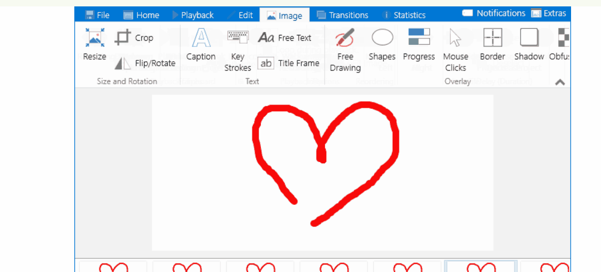

# Projeto com README (título do projeto)
Um projeto de texte com um arquivo README 🚀 (descrição do projeto bem detalhada pode tambem colocar gifs e imagens)

[](https://google.com)

## Tecnologias utilizadas
- HTML
- CSS
- JS

## Como utilizar

(passo para  lidar com o rojeto)

Clone o projeto
```
git clone <url>
```

Acesse a pasta do projeto
```
cd repositorio-com-readme
```